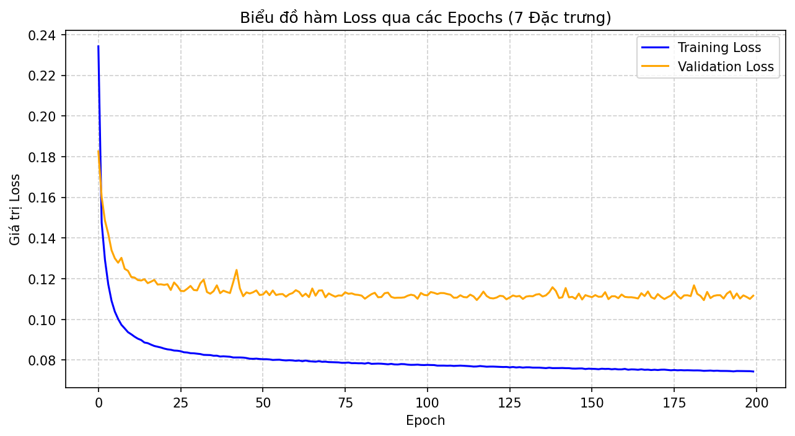
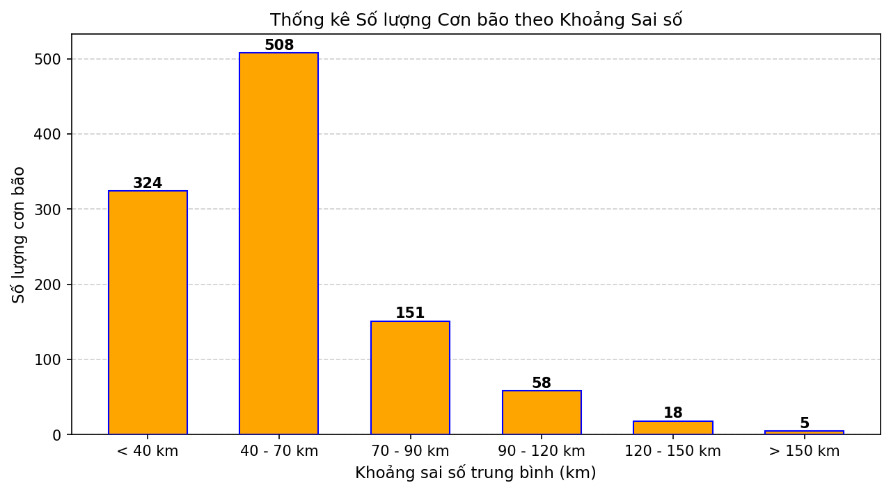
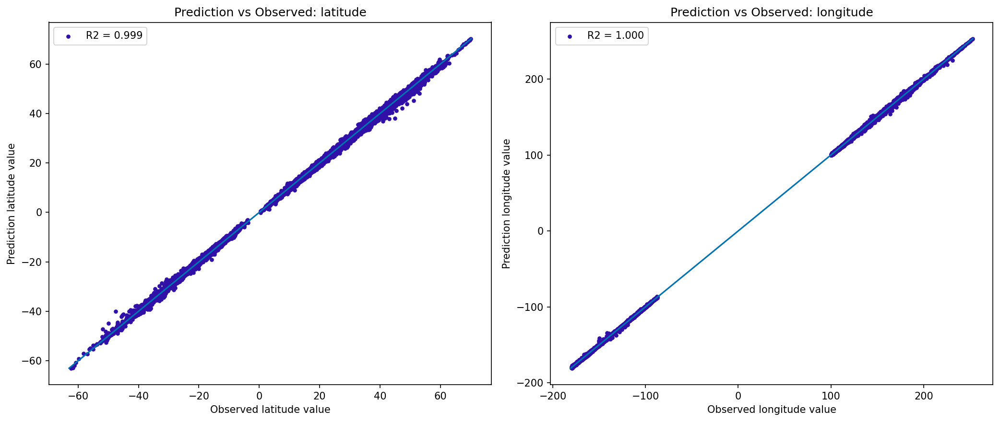

# Dự báo quỹ đạo bão bằng Mạng Nơ-ron Ma trận (MNN)

Dự báo vị trí tâm bão **sau 12 giờ** từ dữ liệu quỹ đạo lịch sử IBTrACS, sử dụng **Matrix Neural Network (MNN)** – mạng nơ-ron nhận đầu vào và tạo đầu ra ở dạng ma trận thay vì vector.

## Dữ liệu

`ibtracs-tbd.csv` – trích xuất từ [IBTrACS](https://www.ncei.noaa.gov/products/international-best-track-archive):

- 5431 cơn bão, giai đoạn 1940 – 2026
- 3 lưu vực: Tây Bắc Thái Bình Dương (WP), Đông Bắc Thái Bình Dương (EP), Nam Thái Bình Dương (SP)
- Bước thời gian 3 giờ
- Các cột sử dụng: `ID`, `LAT`, `LON`, `STORM_SPEED`, `STORM_DIR`

## Phương pháp

### Tiền xử lý

Mỗi thời điểm của một cơn bão được biểu diễn bằng 5 đặc trưng:

| Đặc trưng | Ý nghĩa |
|---|---|
| Δlon, Δlat | Kinh độ, vĩ độ tương đối (có xử lý trường hợp vượt kinh tuyến 180°) |
| speed | Tốc độ di chuyển của bão |
| sin(dir), cos(dir) | Hướng di chuyển được mã hóa vòng tròn |

- **Cửa sổ trượt** gồm 4 thời điểm liên tiếp (9 giờ quan trắc) → ma trận đầu vào kích thước **4 × 5**.
- Tọa độ trong cửa sổ được lấy tương đối so với **điểm neo** (thời điểm cuối của cửa sổ).
- **Mục tiêu**: độ dời (Δlon, Δlat) của tâm bão sau 4 bước (12 giờ) so với điểm neo.
- Chuẩn hóa bằng `StandardScaler` (chỉ fit trên tập huấn luyện).
- Chia tập theo cơn bão, theo thứ tự thời gian: **70% huấn luyện / 10% kiểm định / 20% kiểm thử**.

### Kiến trúc MNN

Mỗi nơ-ron ma trận tại vị trí (j, k) tính:

```
u[j,k] = w_jkᵀ · X · v_jk + θ[j,k]
```

trong đó `w_jk` (W_L) và `v_jk` (W_R) là hai vector trọng số trái/phải, tương đương một ma trận trọng số hạng 1 – số tham số ít hơn nhiều so với mạng kết nối đầy đủ.

```
Đầu vào 4×5 → [MNN + LayerNorm + act] 25×8 → [MNN + LayerNorm + act] 50×10 → [MNN] 1×2
```

Hàm kích hoạt đại số: `f(x) = x / √(1 + x²)`.

### Huấn luyện

- Hàm mất mát: MSE trên độ dời đã chuẩn hóa
- **Học hai giai đoạn luân phiên**: hai bộ tối ưu Adam riêng biệt, lần lượt cập nhật nhóm W_L (cùng bias, tham số LayerNorm) rồi nhóm W_R
- Learning rate 1e-4, cắt gradient trong [-1, 1], 200 epoch, mỗi batch là một cơn bão
- Lưu mô hình có loss kiểm định thấp nhất

### Đánh giá

Độ dời dự báo được cộng lại vào điểm neo để thu tọa độ tuyệt đối, sau đó tính:

- MAE và RMSE theo khoảng cách **Haversine** (km)
- Phân bố sai số trung bình theo từng cơn bão
- Hệ số R² cho kinh độ và vĩ độ
- Bản đồ quỹ đạo thực tế và dự báo cho từng cơn bão trong tập kiểm thử

## Cài đặt và chạy

Yêu cầu Python 3 và các thư viện:

```bash
pip install tensorflow numpy pandas scikit-learn matplotlib cartopy
```

Chạy toàn bộ quy trình (nạp dữ liệu → huấn luyện → kiểm thử → đánh giá → vẽ đồ thị):

```bash
python MNN_Main.py
```

> **Lưu ý:** mô hình được lưu tạm tại `C:\tmp_cyclone_model` (thư mục này bị xóa và tạo lại mỗi lần chạy). Khi chạy trên Linux/macOS cần sửa biến `save_dir` trong `Training.py` và `Testing.py`.

### Kết quả đầu ra

| Tệp | Nội dung |
|---|---|
| `Training_Loss_Curve.png` | Loss huấn luyện và kiểm định theo epoch |
| `Error_Distribution_Chart.png` | Số lượng cơn bão theo khoảng sai số |
| `R2_Scatter_Plot.png` | Biểu đồ phân tán dự báo – quan trắc cho vĩ độ, kinh độ |
| `Cyclone_Maps_All/` | Bản đồ quỹ đạo của từng cơn bão trong tập kiểm thử |

## Cấu trúc mã nguồn

| Tệp | Chức năng |
|---|---|
| `MNN_Main.py` | Chương trình chính: nạp dữ liệu, chia tập, gọi huấn luyện/kiểm thử, đánh giá và vẽ đồ thị |
| `Data_Processing.py` | Tạo cửa sổ trượt và mục tiêu độ dời |
| `Add_Layer.py` | Định nghĩa một lớp nơ-ron ma trận |
| `Training.py` | Xây dựng mạng, huấn luyện hai giai đoạn, lưu mô hình tốt nhất |
| `Testing.py` | Khôi phục mô hình và dự báo trên tập kiểm thử |

## Kết quả






